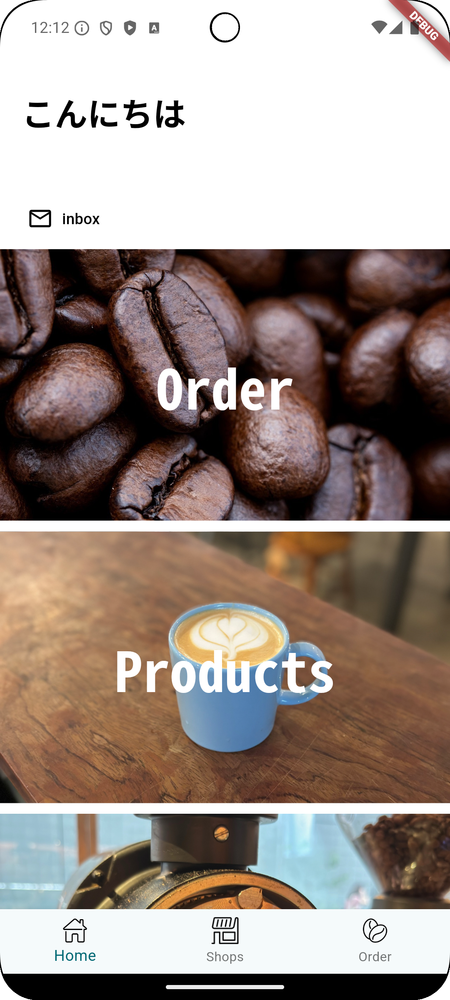

<p align="center">

コーヒー豆注文アプリケーション ☕️☕️☕️
</p>
<p align="center">


<a href="https://github.com/hosokawa-kenshin/Gcal.js/blob/main/README-ja.md">
    
  </a>

<br>
</p>

<p>
<p align="center">
<a href="https://github.com/hosokawa-kenshin/Gcal.js" target="__blank"></a>
</p>

<p align="center">



</p>

## LatinOne
本リポジトリは，2024年度乃村研究室勉強会の題材として開発したコーヒー豆注文アプリのリポジトリである．

## SDK Version
```bash
Doctor summary (to see all details, run flutter doctor -v):
[✓] Flutter (Channel stable, 3.24.5, on macOS 12.6 21G115 darwin-arm64, locale ja-JP)
[✓] Android toolchain - develop for Android devices (Android SDK version 34.0.0)
[✓] Xcode - develop for iOS and macOS (Xcode 14.2)
[✓] Chrome - develop for the web
[✓] Android Studio (version 2023.2)
[✓] VS Code (version 1.96.2)
[✓] Connected device (3 available)
```

## Setup
1. 本プロジェクト を clone する
```bash
git clone git@github.com:hosokawa-kenshin/latin_one.git
```
2. 依存関係をインストールする
```bash
cd latin_one
flutter pub get
```
3. アプリを実行する
```bash
flutter run
```

## Features
- データベース (Firebase Firestore)
- プッシュ通知 (Firebase Cloud Messaging)
- コーヒー豆の注文

## License
このプロジェクトはBSD 3-Clause Licenseの下でライセンスされている．
詳細については，[LICENSE](LICENSE)ファイルを参照．
